# passthrough-mod-toolkit

**Scaffold a _passthrough mod_: two games as two processes bridged over local IPC (shared memory) — e.g. a Minecraft Fabric mod on the guest side, an SKSE / BepInEx / ScriptHookV plugin on the host — generated from a single `schema.yaml`.**

> **Also known as:** passthrough mod · cross-game bridge · two-game mashup · two-process game bridge · game mod bridge generator · 跨游戏桥联 · 游戏缝合

This repo is the **scaffold toolkit**: it generates the fixed bones of that bridge — protocol headers in five languages, fake-host/fake-guest stubs, a shared-memory layout, and a zero-dependency MCP server. It does **not** run your games and does **not** contain any game code. See [Honest limits](#honest-limits).

## Contents

- [What a passthrough mod actually is](#what-a-passthrough-mod-actually-is)
- [When to use this / When NOT to](#when-to-use-this--when-not-to)
- [30-second demo](#30-second-demo)
- [Quickstart](#quickstart)
- [Machine-readable summary](#machine-readable-summary)
- [How it works — the five pieces](#how-it-works--the-five-pieces)
- [Honest limits](#honest-limits)
- [Credits](#credits)
- [License](#license)

---

## What a passthrough mod actually is

Two games, two processes, one local bridge. Division of labour is fixed:

- **Guest side owns the body** — movement, collision, inventory, combat.
- **Host side owns the world** — terrain, NPCs, save, and the picture on screen.

The bridge is **not one mod**. It is **five things**:

| # | Piece | What it is |
|---|-------|------------|
| ① | **Guest-side mod** | Runs inside the guest game (e.g. a Minecraft Fabric mod). |
| ② | **Host-side plugin** | Runs inside the host game (SKSE / BepInEx / ScriptHookV `.asi`). |
| ③ | **Transport layer** | The **shared-memory / WebSocket convention**. A *contract*, not a plugin. |
| ④ | **Frame compositor** | ReShade add-on or in-host renderer. **Independent of both game processes.** |
| ⑤ | **Launcher** | Starts both processes, opens channels, does heartbeat + capture. |

### Architecture

```mermaid
graph LR
    subgraph Guest["GUEST PROCESS — owns the body"]
        GM["① Guest mod<br/>(Minecraft / etc.)"]
    end
    subgraph Host["HOST PROCESS — owns the world"]
        HP["② Host plugin<br/>(SKSE / BepInEx / ScriptHookV)"]
    end
    subgraph Bridge["THE BRIDGE (this toolkit's output)"]
        T["③ Transport layer<br/>(shared mem + WebSocket — a CONTRACT)"]
        C["④ Frame compositor<br/>(ReShade add-on / in-host render)"]
        L["⑤ Launcher<br/>(start, heartbeat, capture)"]
    end
    GM <-->|"③ control + frame"| HP
    C -.->|"reads host depth/buffer"| HP
    L -->|"spawns & wires"| GM
    L -->|"spawns & wires"| HP
    style Bridge fill:#1b1b2f,stroke:#666
    style T fill:#16213e,stroke:#4a90d9
    style C fill:#16213e,stroke:#4a90d9
    style L fill:#16213e,stroke:#4a90d9
```



Plain-text fallback:

```
        ┌─────────────┐        ③ transport (shared mem + WS)        ┌─────────────┐
        │ GUEST PROC  │ <─────────────────────────────────────────> │  HOST PROC  │
        │ ① guest mod │                                            │ ② host plug │
        │ owns body   │                                            │ owns world  │
        └─────────────┘                                            └──────┬──────┘
              ▲                                                         │ ④ reads depth
              │ ⑤ launcher spawns + wires both                         │   /buffer
              └─────────────────────────────────────────────────────────┘
```

---

## When to use this / When NOT to

**Use this toolkit when:**

- You want to build a **passthrough mod** (two games as two processes over local IPC) and don't want to re-derive the shared-memory protocol, struct layouts, and epoch/heartbeat guards from scratch.
- You want **one schema → protocol bindings in C++ / C# / Java / Rust / Python**, with a round-trip proof that the schema reproduces three real ecosystems' headers with zero structural diff.
- You want to **develop without the games installed** — the fake-host/fake-guest stubs run the three classic failure scenarios (heartbeat timeout, epoch invalidation, steep-wall collision) as plain Python processes.
- You are an **agent** looking for a scaffold and a checklist, not a finished mod.

**Do NOT use this toolkit when:**

- You want a **ready-to-play mod**. This ships a skeleton; the host-side plugin (②) is yours to write and measure. If you skip [Honest limits](#honest-limits) you will waste weeks.
- You want to mod a **single game** — use that game's normal modding stack; a two-process bridge is the most expensive way to add content.
- You need **on-hardware-verified parameters**. Nothing here is. Every 🔴 parameter in `params/params.yaml` (`verified_on_hardware: false`) must be measured on your own build.
- You want anything to do with **online play, anti-cheat, or EULA circumvention**. Out of scope, by hard rule. All samples are treated as single-player.

---

## 30-second demo

```
==============================================================================
 PTmodmaker unified passthrough stubs - demo trace  (no game, no engine)
==============================================================================
 transport       : shared memory mapping (MAP_SHARED over a file)
 mapping bytes   : 33685504   units_per_block=70.0
 cross-check     : 28 struct sizes vs another generator's binding -> AGREE

[a] heartbeat timeout   host killed @ 1.8s
    guest froze=True  stayed frozen to exit=True  exit=0  stderr=''
    alive/frozen  t=0 .. 5.0s   green = host alive, red = frozen
    ##############################################..................
    => PASS

[b] epoch invalidation  1 -> 2  (host restart)
    session discards=1  invalid ticks=11  teleports=1 (late=[])  max tick dx=0.05
    epoch-sensitive  t=0 .. 6.0s   green = epoch valid, red = stale epoch discarded
    #########################...####################################
    => PASS

[c] steep wall          wall at x=8.0 h=6.0  slope=90.0deg (walkable limit 50.0deg)
    guest max x=7.7  max y=1.283  crossed=False  climbed=False  blocked ticks=292
  side view   o/@=guest  #=wall(x=8.0)  ~=floor
  |                                                                |
  |                                             #                  |
  |                             oo     oooooo   #                  |
  |                              ooo  oo     oo #                  |
  |~~~~~~~~~~~~~~~~~~~~~~~~~~~~~~~~oooo~~~~~~~@~#~~~~~~~~~~~~~~~~~~|
    => PASS

verdict: a=PASS  b=PASS  c=PASS   OVERALL=PASS
==============================================================================
```

**No game, no engine, no GPU.** That is two Python processes on one shared-memory
mapping which is itself **generated from `schema.yaml`** — the same definition the
multi-language backends are generated from. Full capture in
[`demo/demo.txt`](demo/demo.txt); regenerate with `python demo/render_demo.py`.

The three PASSes are **falsifiable**: `stubs/negative_control.py` disables each
guard in turn, and exactly the matching scenario flips to FAIL. A green demo you
cannot break on purpose is not evidence.

---

## Quickstart

A passthrough bridge is driven by a **two-layer schema**: a fixed `container` (the
memory layout, never edited per host) and a `vocabulary` (the per-host "words" you fill in).
This is the single hardest claim in the repo and it is **measured**, not hoped:

> One `schema.yaml` round-tripped the protocol headers of **three** engines
> (SkyCraft / FalloutCraft / ValCraft) with **structural diff = 0**.
> — [`schema/REPORT.md`](schema/REPORT.md)

A ~20-line vocabulary excerpt (real documented values; see that report for the full file):

```yaml
schema_version: 1
vocabularies:
  skyrim:                      # MIT source: chasmlol/SkyCraft
    namespace: skycraft::proto
    kMagic: 0x43594B53
    kUnitsPerBlock: 70.0       # [reported] per host author; verify on hardware
    yaw_expr: "f(rotZ)"        # [inferred] author states it MUST be measured — no value shipped
  gta5:                        # MIT source: rehan-remade/universal-modder
    namespace: gta::proto
    kUnitsPerBlock: 1.0        # [reported] 1 GTA metre = 1 MC block
    yaw_expr: "180 - heading"  # [reported] per host author; verify on your build
  valheim:                     # [inferred] read-only; NOT emitted (no LICENSE)
    namespace: valcraft::proto
    kUnitsPerBlock: 1.0
```

Generate bindings in **five languages** from that one schema:

```bash
python -m pip install ./ptgen          # installs the `ptgen` console script (PyYAML is the only dependency)

ptgen --schema schema/schema.yaml --lang cpp    --host SKY --out out/
ptgen --schema schema/schema.yaml --lang python --host SKY --out out/
# --lang csharp | java | rust also available

python schema/verify_roundtrip.py      # regression: real MIT headers, structural diff must be 0
python stubs/run_demo.py               # the three scenarios in the demo above
```

Drive it from an agent over MCP (**JSON-RPC over stdio, zero extra deps**):

```bash
python mcp/server.py
```

Tools exposed: `pt_schema_validate` · `pt_schema_describe` · `pt_param_lookup` ·
`pt_stub_run` · `pt_scaffold` — full self-descriptions in [`mcp/REPORT.md`](mcp/REPORT.md).

Full install notes (3 commands): [`install.md`](install.md).
Working from a fresh clone? [`ASSEMBLING.md`](ASSEMBLING.md) gives the exact
directory layout, the link-rewrite commands, and the pre-push checks.

You still write ② (the host plugin) by hand — see [Honest limits](#honest-limits).

---

## Machine-readable summary

```yaml
toolkit:
  name: passthrough-mod-toolkit
  one_liner: >
    Fill in a per-host vocabulary sheet; get the fixed bones of a passthrough mod —
    a two-process game bridge over local IPC (shared memory / WebSocket).
  generates:
    - shared-memory protocol headers from one schema.yaml (C++ / C# / Java / Rust / Python)
    - fake-host / fake-guest stubs (heartbeat, epoch invalidation, collision scenarios)
    - ctypes shared-memory layout derived from the same schema
    - schema-driven parameter library with evidence tiers (params/params.yaml)
    - zero-dependency MCP server (5 tools, JSON-RPC over stdio)
  does_not:
    - run, patch, or crack any game
    - write the host-side plugin (the ~20% that is per-build magic numbers)
    - bundle game files or loader binaries (SKSE / ScriptHookV / ReShade)
    - redistribute no-license code (ValCraft header is NOT included, by design)
    - claim any on-hardware verification (verified_on_hardware is false everywhere)
  license: MIT (third-party MIT headers credited in headers/NOTICE.md)
  entry_points:
    cli: ptgen --schema schema/schema.yaml --lang cpp --host SKY --out out/
    demo: python stubs/run_demo.py
    proof: python schema/verify_roundtrip.py
    mcp: python mcp/server.py
  evidence_tiers: [measured, reported, inferred]
  keywords: [passthrough mod, cross-game bridge, two-process game bridge, IPC,
             shared memory, codegen, skeleton generator, Minecraft, SKSE, BepInEx,
             ScriptHookV, game modding, schema-driven]
```

---

## How it works — the five pieces

- **① Guest mod** — template for the body-side plugin (injection points, mixin list).
  ~50% templateable; the rest tracks each guest-game version.
- **② Host plugin** — **the part this toolkit cannot write for you.** ~20% templateable
  (Link layer + scan/probe helpers); the rest is per-host natives, Havok decoding, etc.
- **③ Transport layer** — pure convention, zero game logic. **~100% generated.** This is
  the toolkit's home turf: one schema → protocol header for C++/C#/Rust/Java.
- **④ Frame compositor** — shader skeleton + triple-buffer generated; depth convention,
  hook point, and axis mapping are per-host. ~60% generated.
- **⑤ Launcher** — spawn processes, open channels, heartbeat, capture. ~90% scripted.

> Evidence tier for the percentages above: **[inferred]** for ①④ (extrapolated from 3
> samples); **[measured]** for ②③⑤ (line counts and responsibility boundaries read from source).

---

## Honest limits

This section is **not softened on purpose.** If you skip it you will waste weeks.

- **This toolkit does _NOT_ run your game for you.** It emits a skeleton. You install the
  games, the loaders, and write the host-side plugin. It does not launch, patch, or crack anything.

- **Host-side plugin code is 🔴 MUST BE MEASURED ON REAL HARDWARE.** The following can
  **never** be copied from a sample and trusted — they are magic numbers per build:
  - Camera / pose matrices and the **yaw / pitch expressions** (e.g. SkyCraft's `f(rotZ)`
    is, by the host author's own note, *not* written down — it must be measured).
  - Coordinate mapping, `yOffset` calibration, and **depth convention** (reversed-Z vs normal).
  - Collision probe strategy and its object-count ceiling (one sample hard-crashes past ~1500 script objects).
  - Reprojection (6-DoF light-march) tuning and pose-lag.
  - Any loader / hook API surface for the specific game build you target.

- **Evidence tiers used throughout this repo:**

  | Tier | Meaning |
  |------|---------|
  | `measured` | Verified this round (e.g. schema round-trip diff = 0 on 3 engines). |
  | `reported` | Stated by a project's own docs/README; not re-verified by us on hardware. |
  | `inferred` | Derived from design or extrapolated from a small sample; unverified. |

- **This repository has ZERO on-hardware verification.** The author's machine cannot run
  the games (125 GB installs, GPU/anti-cheat constraints). **Every number in this repo
  comes from line-by-line source comparison**, not from playing. The wider ecosystem is
  the same: in the authoritative 70-entry directory, **all 70 entries have no
  third-party playtest record.** Treat nothing here as "known good on a real rig."

- **"Builds a skeleton" ≠ "builds a bridge."** The fixed bones are ~11.5% of the code by
  line count; the other ~88.5% is per-game translation logic, and the most expensive
  knowledge (constant calibration, gotchas) lives entirely there.

---

## Credits

This project follows the MIT-compliance template set by
[`zeyvu/FalloutCraft`](https://github.com/zeyvu/FalloutCraft) (the cleanest example in
the ecosystem of "reused which three things, explicitly").

### Code we build on (MIT — copyright retained)

- **[chasmlol/SkyCraft](https://github.com/chasmlol/SkyCraft)** — MIT.
  Copyright (c) chasmlol. We reuse its *idea*, the two-games-over-shared-memory design,
  and the shared-memory protocol header shape (the de-facto standard, 568 lines, ~85–99%
  verbatim across the family).
- **[rehan-remade/universal-modder](https://github.com/rehan-remade/universal-modder)** —
  MIT. Copyright (c) rehan-remade. The `examples/minecraft-gta5-passthrough` sample
  (MIT) informs the WebSocket-control + shared-memory-frame split and the fake-host/fake-guest stubs.

### Authors acknowledged

chasmlol (SkyCraft), rehan-remade (universal-modder), zeyvu (FalloutCraft, for the
compliance template), and the `bailo167/awesome-game-mashups` curators (CC0-1.0 seed data).

### Read but not copied

The following repositories were **read for structure only**. They ship **no LICENSE**
("all rights reserved" by default). **Zero lines of their code are adopted or emitted**
by this toolkit, per our hard rule (see `RELEASE_CHECKLIST.md`, R3):

- **`LoAlCo/ValCraft`** — structure read (protocol-header rename, BepInEx/C# host). No code used.
- **`FFwLo/EldenKill`** — structure read (the `host-` / `guest-` / `protocol/` directory
  convention, Rust host). No code used.
- **`chasmlol/chasm-bridge-fnv`** — structure read (host-side bridge predecessor). No code used.

---

## License

Released under the **MIT License** — see [`LICENSE`](LICENSE). Third-party attributions are listed in
[`THIRD-PARTY-NOTICES.md`](THIRD-PARTY-NOTICES.md).

You may use, modify, and redistribute, including commercially, **provided you keep the
copyright notices and the full license text** for the MIT components above. You may **not**
bundle game files, loader binaries (SKSE / ScriptHookV / ReShade), or code from the
no-license projects listed under "Read but not copied."
